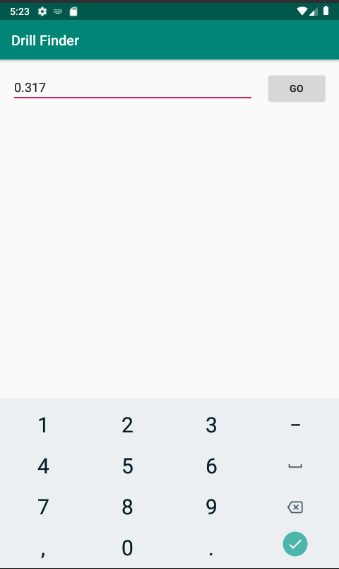
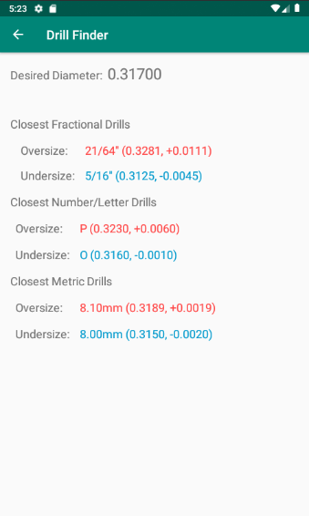

This is an app idea I had which was born out of my experience working as a machine builder and having to deal with hole diameters
on drawings expressed in decimal form, but not referencing any particular drill size. This meant that if I wasn't familiar with 
the size of hole already, I'd have to check a drill chart to see what drills were available around that size, which was 
complicated by there being fractional, letter/number, and metric drill series to choose from.

To solve this problem, I taught myself Android programming using the Google documentation and created an Android app that would allow me to input a hole diameter in inches, after which it 
would give me a list of drills from each series that were closest to the desired diameter. The options from each series 
were given as closest undersize drill and closest oversize drill, with the amount of under/over sizing displayed alongside the drill designation.

This app also had the unintended function of allowing me to quickly look up the closest fraction (down to 1/64 resolution) to a particular decimal value.

The user of the app inputs their desired hole diameter on this screen: 

And is given a selection of drills from three drill series to choose from on this screen:

